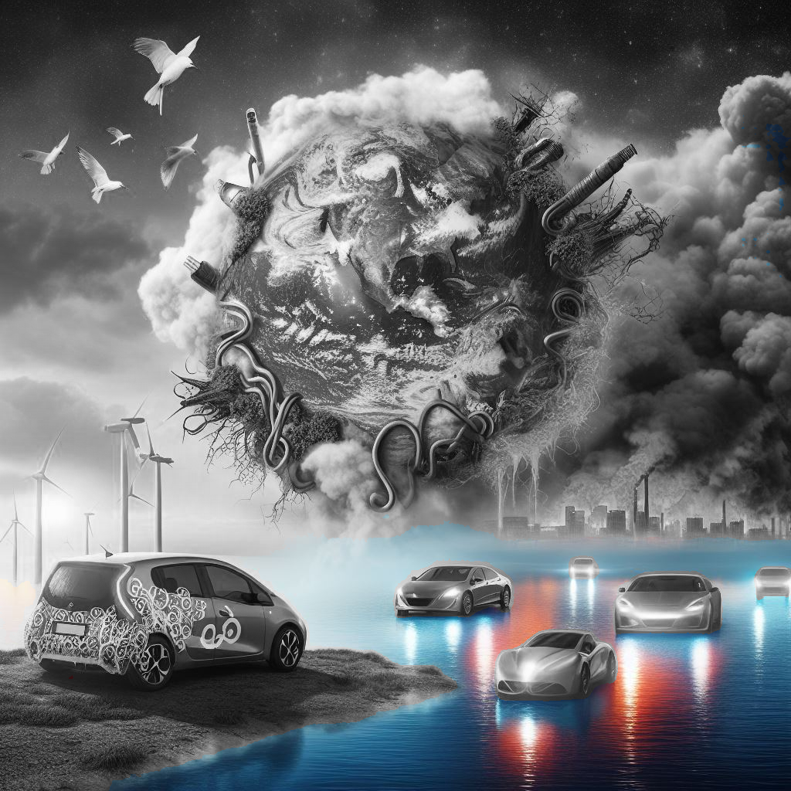

# CO2 Emission Trends and Electric Vehicle Sales Analysis

Explore the dynamic relationship between CO2 emissions since 1850 and Electric Vehicle (EV) sales in this repository. Analyze historical trends, correlation insights, and future implications. Contribute to advancing sustainable mobility understanding. Licensed under MIT. Join us in shaping a greener future.

## Overview

This repository hosts a comprehensive analysis of the historical trends in CO2 emissions since 1850 and its correlation with the sales of Electric Vehicles (EV). The analysis delves into the dynamic relationship between environmental factors and consumer behavior, providing valuable insights into the global transition towards sustainable transportation.

## Key Insights

- **Historical Perspective**: By examining CO2 emissions dating back to 1850, this analysis offers a historical context to the current environmental challenges, highlighting significant milestones and trends in carbon emissions.
- **Impact on Electric Vehicle Sales**: Through statistical analysis and data visualization, the correlation between rising CO2 emissions and the increasing demand for Electric Vehicles is explored, providing actionable insights for policymakers, researchers, and industry stakeholders.
- **Future Implications**: The analysis extrapolates current trends to forecast the future trajectory of CO2 emissions and Electric Vehicle sales, offering valuable foresight into the evolving landscape of sustainable mobility.

## Repository Contents

- **Data Files**: Raw datasets used in the analysis, including CO2 emission records and Electric Vehicle sales figures.
- **Jupyter Notebooks**: Python scripts and Jupyter notebooks containing the code for data preprocessing, analysis, and visualization.
- **Graphs and Visualizations**: Visual representations of the data insights, including time series plots, correlation matrices, and trend forecasts.

## Contribution

Contributions to this repository, whether in the form of additional datasets, code enhancements, or analytical insights, are highly encouraged. Together, we can advance our understanding of the complex relationship between environmental factors and transportation choices, driving positive change towards a greener future.

## License

This project is licensed under the [MIT License](LICENSE), granting users the freedom to utilize, modify, and distribute the analysis and its findings for both academic and commercial purposes, with proper attribution.

## Acknowledgments

Special thanks to [https://www.ons.gov.uk/] for their invaluable collection of the data.
